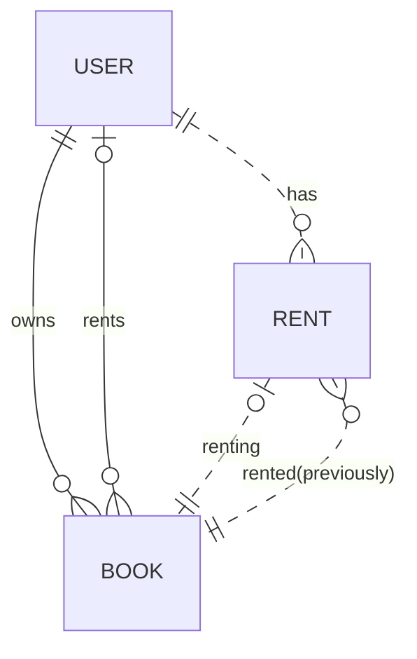
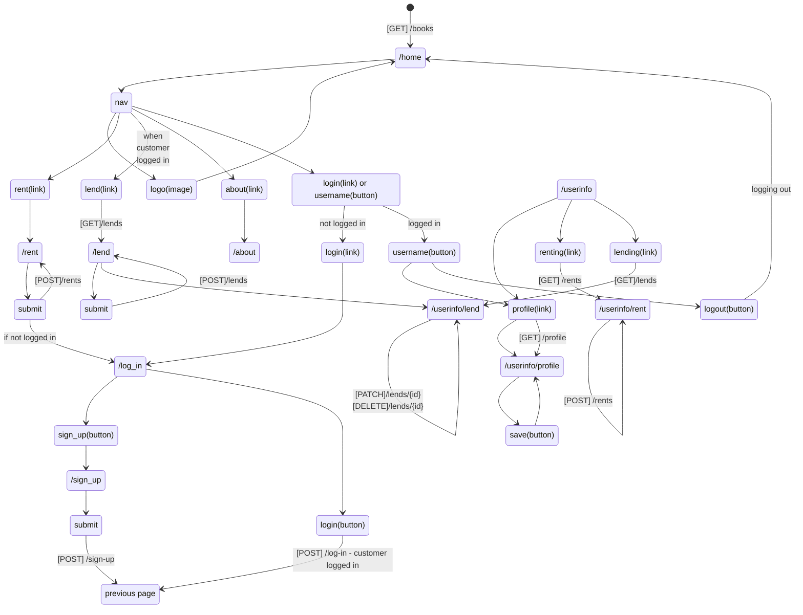
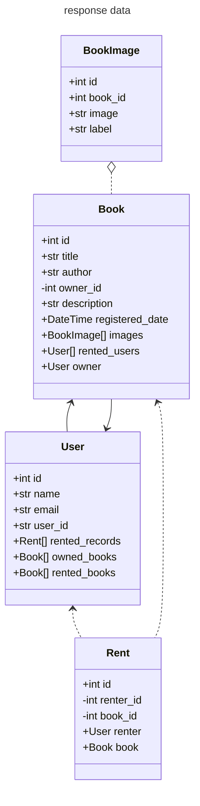
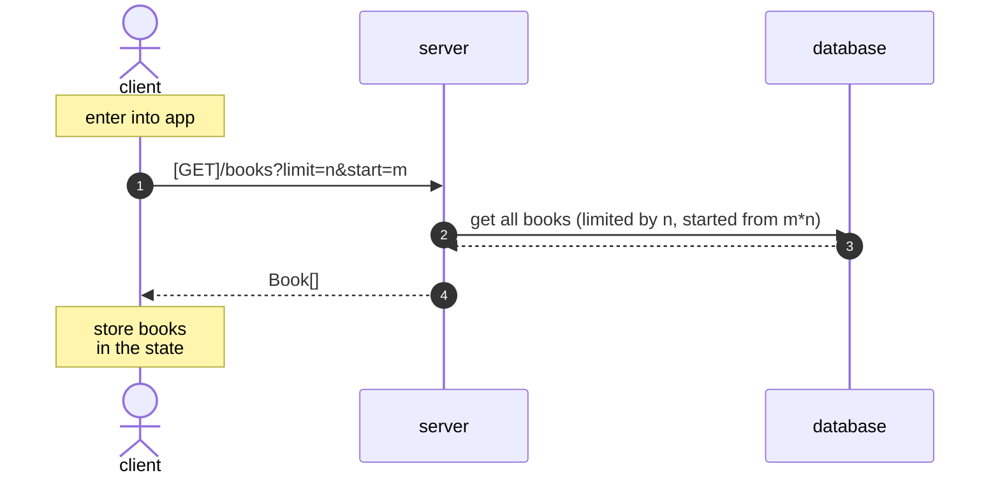
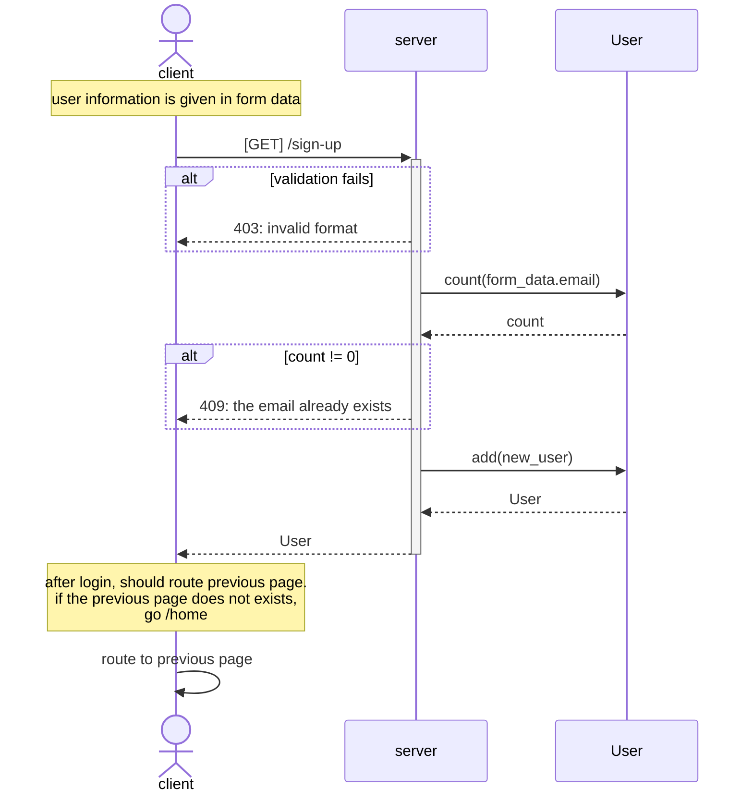
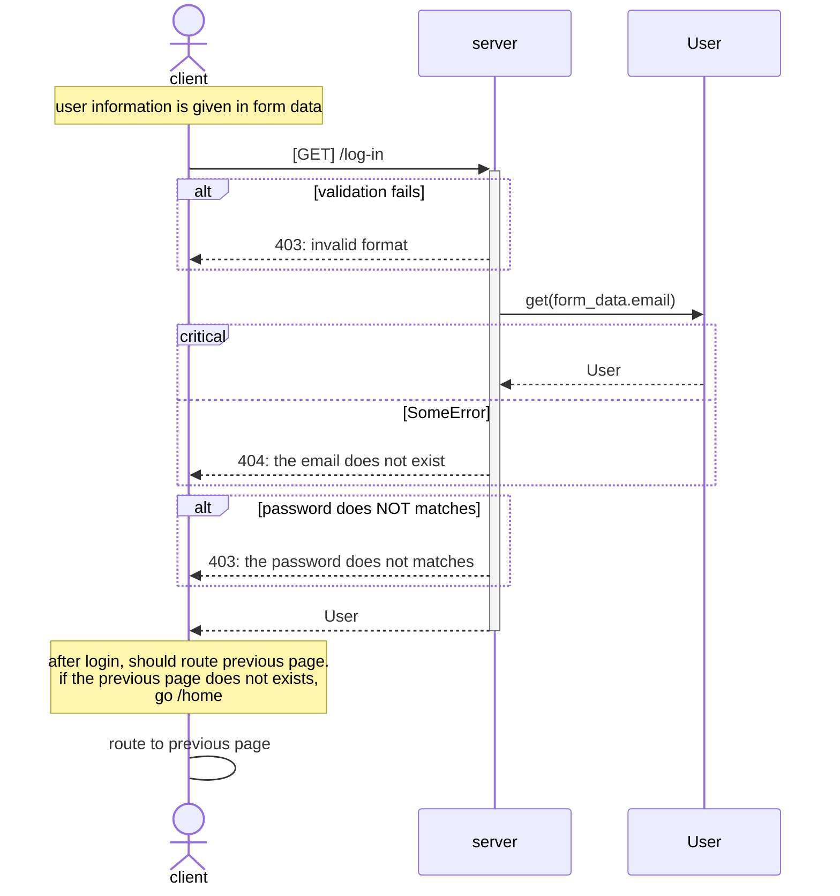
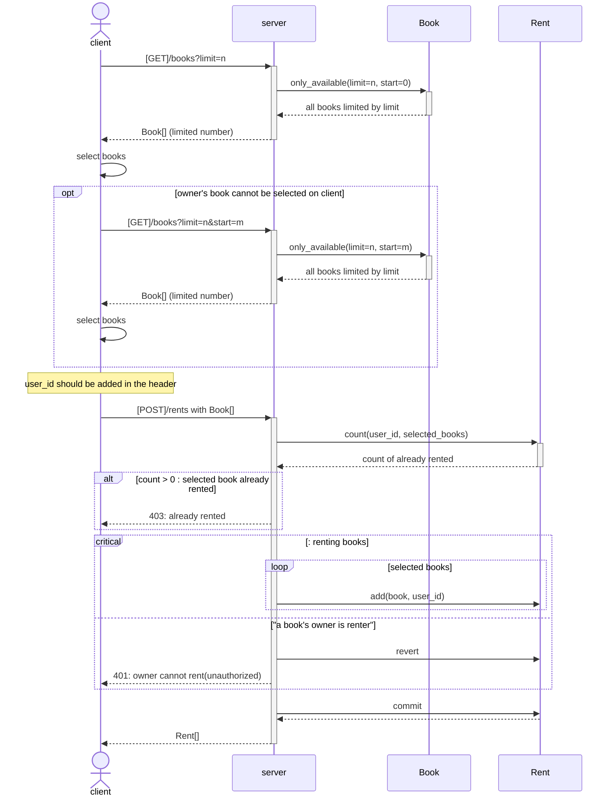
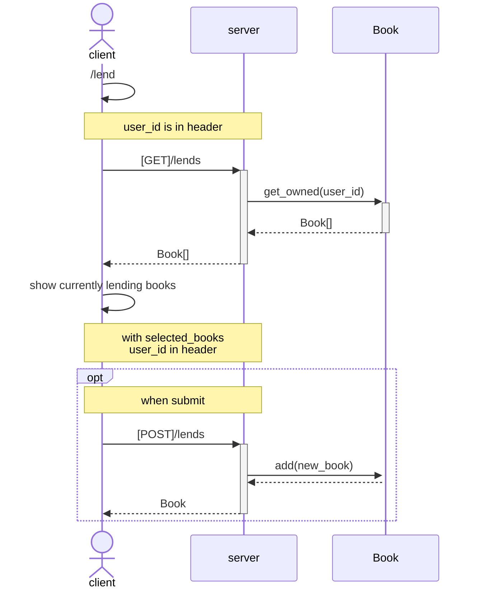
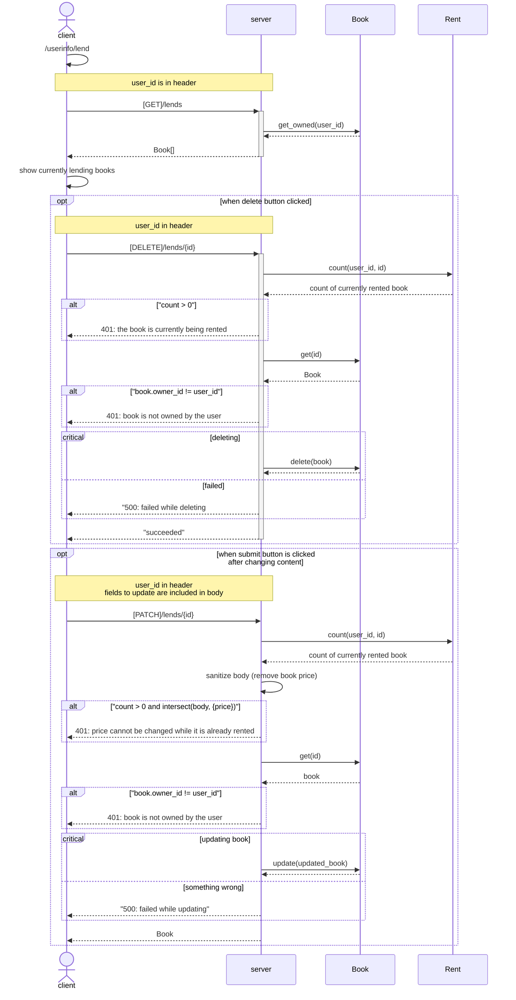

# book-share

platform to share books

## requirements

- book owner can register their books to lend
- renter can rent books
- sign-up with id/password (MVP)
- lend menu shows up after login
- rent is allowed without login (forcing login when clicking rent button)
- on book list, renter can select books and rent books
- on account page, renter can confirm the renting books
- on account page, lender can confirm their books which is currently lending with renter
-

## model design

## ui route design

## backend rounte design

## Sequence Diagram

### enter app (/home)

### sign up (/sign_up)

### log in (/log_in)

### rent (/rent)

## lend (/lend, /userinfo/lend)

### /lend (from nav bar)

### /userinfo/lend (from profile page > lend menu)

